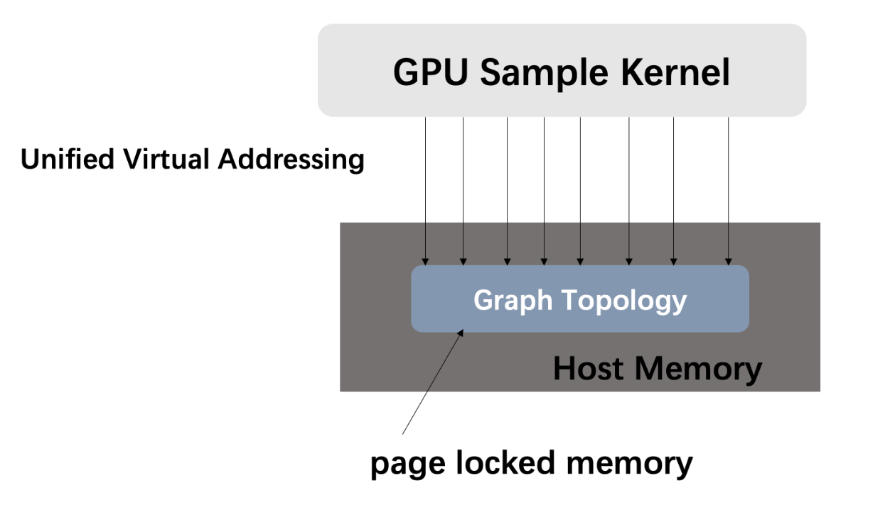
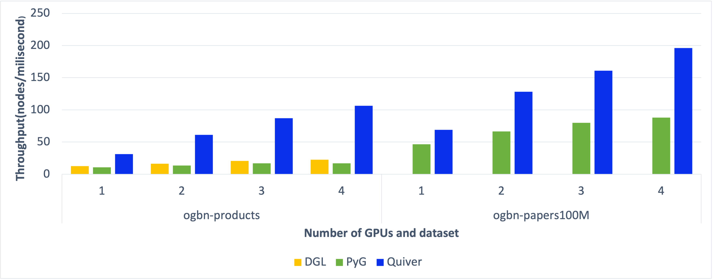

[pypi-image]: https://badge.fury.io/py/torch-geometric.svg
[pypi-url]: https://pypi.org/project/torch-quiver/

<p align="center">
  
</p>

--------------------------------------------------------------------------------


**Quiver** is a high-performance GNN training add-on which can fully utilize the hardware to achive the best GNN trainning performance. By integrating Quiver into your GNN training pipeline with **just serveral lines of code change**, you can enjoy **much better end-to-end performance** and **much better scalability with multi-gpus**, you can even achieve **super linear scalability** if your GPUs are connected with NVLink, Quiver will help you make full use of NVLink.

--------------------------------------------------------------------------------

## Library Highlights

If you are a GNN researcher or you are a `PyG`'s or `DGL`'s user and you are suffering from consuming too much time on graph sampling and feature collection when training your GNN models, then here are some reasons to try out Quiver for your GNN model trainning.

* **Easy-to-use and unified API**:
Integrate Quiver into your training pipeline in `PyG` or `DGL` is just a matter of several lines of code change. We've also implemented IPC mechanism which makes it also a piece of cake to use Quiver to speedup your multi-gpu GNN model training (see the next section for a [quick tour](#quick-tour-for-new-users)). 

* **Greate performance and scalibility**: Using CPU to do graph sample and feature collection not only leads to poor performance, but also leads to poor scalability because of CPU contention. Quiver, however, can achieve much better scalability and can even achieve `super linear scalibility` on machines equipped with NVLink.


## Quick Tour for New Users

In this quick tour, we highlight the ease of integrating Quiver into your training pipeline with only a few lines of code change.

### A simple example

In the first glimpse of Quiver, we integrate it into the training pipeline of [offical redit examples from PyG](https://github.com/pyg-team/pytorch_geometric/blob/master/examples/reddit.py). With about 5 lines of code change, you can achieve about 2x training speedup. You can check [our reddit example](examples/pyg/reddit_quiver.py) for details.

```python
...
#############################################
# Original PyG's Code About Sampler
############################################
#train_loader = NeighborSampler(data.edge_index, node_idx=data.train_mask,
#                               sizes=[25, 10], batch_size=1024, shuffle=True,
#                               num_workers=12)

#############################################
# Integrate Quiver: Using Quiver's sampler
############################################
train_loader = torch.utils.data.DataLoader(train_idx,
                                           batch_size=1024,
                                           shuffle=True,
                                           drop_last=True)

csr_topo = quiver.CSRTopo(data.edge_index)
quiver_sampler = quiver.pyg.GraphSageSampler(csr_topo, sizes=[25, 10])
...

######################
# Original Pyg's Code
######################
#x = data.x.to(device)

#############################################
# Integrate Quiver: Using Quiver's Feature
############################################
x = quiver.Feature(rank=0, device_list=[0], device_cache_size="1G", cache_policy="device_replicate", csr_topo=csr_topo)
x.from_cpu_tensor(data.x)
...

```

### More examples
We provide serveral examples to show how to use Quiver in single GPU training and multi-gpu traning.

- [single device on ogbn-product](examples/pyg/) and [single device on reddit](examples/pyg/) show how simple to integrate Quiver in PyG's training pipeline.
- [multi-gpu on ogbn-product](examples/multi-gpu/pyg/ogb-products/) and [multi-gpu on reddit](examples/multi-gpu/pyg/reddit/) show how to use Quiver in multi-gpu training.

### API docs

please refer to [our API doc](docs/) to learn how to use Quiver.

## Architecture Overview
Key reasons behind Quiver's high performance are that it provides two key components: `quiver.Feature` and `quiver.Sampler`.

Quiver provide users with **UVA-Based**（Unified Virtual Addressing Based）graph sampling operator, supporting storing graph topology data in CPU memory and sampling the graph with GPU. In this way, we not only get performance benefits beyond CPU sampling, but can also process graphs whose size are too large to host in GPU memory. With UVA, Quiver achieves nearly **20x** sample performance compared with CPU doing graph sample. Besides `UVA mode`, Quiver also support `GPU` sampling mode which will host graph topology data all into GPU memory and will give you 40% ~ 50% performance benifit w.r.t `UVA` sample.




A training batch in GNN also consumed hundreds of MBs memory and move memory of this size across CPU memory or between CPU memory and GPU memory consumes hundreds of milliseconds.Quiver utilizes high throughput between page locked memory and GPU memory, high throughput of p2p memory access between different GPUs' memory when they are connected with NVLinks and high throughput of local GPU global memory access to achieve 4-10x higher feature collection throughput compared to conventional method(i.e. use CPU to do sparse feature collection and transfer data to GPU). It partitons data to local GPU memory, other GPUs's memory(if they connected to current GPU with NVLink) and CPU page locked memory. 

We also discovered that real graphs nodes' degree often obeys power-law distribution and nodes with high degree are more often to be accessed during training and sampling. `quiver.Feature` can also do some preprocess to ensure that hottest data are always in GPU's memory(local GPU's memory or other GPU's memory which can be p2p accessed) and this will furtherly improve feature collection performance during training.


For system design details, you can read our (introduction)[docs/Introduction_en.md], we also provide chinese version: [中文版本系统介绍](docs/Introduction_cn.md)

## Install

## Install by pip

To install the binaries, simply run

```
pip install torch-quiver
```

cuda10.2 and cuda11.1 on Linux are fully tested

|     OS        | `cu102` | `cu111` |
|-------------|---------|---------|
| **Linux**   | ✅      | ✅      |


### Build from  source

clone this project run script

```cmd
$ git clone git@github.com:quiver-team/torch-quiver.git
$ sh ./install.sh
```


## Benchmarks

Here we show benchmark about graph sample, feature collection and end2end training. They are all tested on open dataset.

### Sample benchmark
Quiver's sampling can be configured to use UVA sampling (`mode='UVA'`) or GPU sampling(`mode='GPU'`), hosting the whole graph structure in CPU memory and GPU memory respectively.
We use **S**ampled **E**dges **P**er **S**econd (**SEPS**) as metrics to evaluate sample performance. **Without storing the graph on GPU, Quiver get 20x speedup on real datasets**.


### Feature collection benchmark

We constrain each GPU caching 20% of feature data. Quiver can achieve **10x throughput** on ogbn-product data compared to CPU feature collection.


If your GPUs are connected with NVLink, Quiver can make full use of it and achieve **super linear throughput increase**. Our test machine has 2 GPUs connected with NVLink and we still constrain each GPU caching 20% percent of feature data(which means 40% feature data are cached on GPU with 2 GPUs), we achieve 4~5x total throughput increase with the second GPU comes in.


### End2End training benchmark

With high performance sampler and feature collection, Quiver not only achieve good performance with single GPU training, but also enjoys good scalability. We modify [PyGs official multi-gpu training example](https://github.com/pyg-team/pytorch_geometric/blob/master/examples/multi_gpu/distributed_sampling.py) to train `ogbn-product`([code file is here](example/multi_gpu/pyg/ogb-products)). By constraining each GPU to cache only 20% of feature data, we can achieve better scalability even compared with placing all of feature data in GPU in PyG. 



When training with multi-GPU and there are no NVLinks between these GPUs, Quiver will use `device_replicate` cache policy by default(you can refer to our [introduction](docs/Introductions_en.md) to learn more about this cache policy). If you have NVLinks, Quiver can make several GPUs share their GPU memory and cache more data to achieve higher feature collection throughput. Our test machine has 2 GPUs connected with NVLink and we still constrain each GPU caching 20% percent of feature data(which means 40% feature data are cached on GPU with 2 GPUs), we show our scalability results here:


## Note

If you notice anything unexpected, please open an [issue](https://github.com/quiver-team/torch-quiver/issues) and let us know.
If you have any questions or are missing a specific feature, feel free to discuss them with us.
We are motivated to constantly make Quiver even better.
