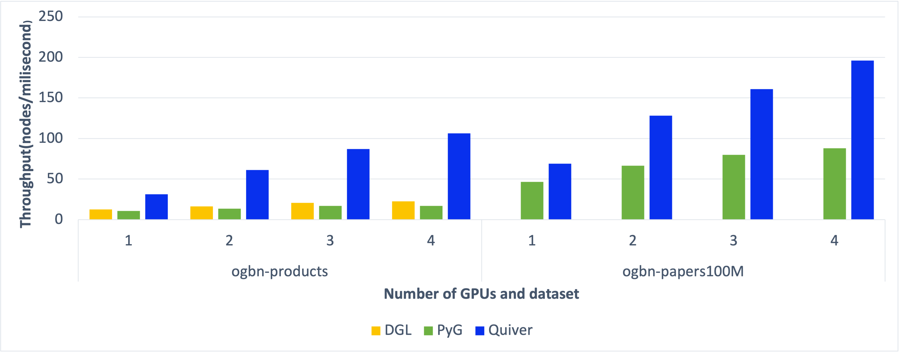

[pypi-image]: https://badge.fury.io/py/torch-geometric.svg
[pypi-url]: https://pypi.org/project/torch-quiver/

<p align="center">
  
</p>

--------------------------------------------------------------------------------

Quiver is a distributed graph learning library for [PyTorch Geometric](https://github.com/pyg-team/pytorch_geometric) (PyG). The goal of Quiver is to make distributed graph learning easy-to-use and achieve high-performance.

[](https://torch-quiver.readthedocs.io/en/latest/?badge=latest)


<!-- **Quiver** is a high-performance GNN training add-on which can fully utilize the hardware to achive the best GNN trainning performance. By integrating Quiver into your GNN training pipeline with **just serveral lines of code change**, you can enjoy **much better end-to-end performance** and **much better scalability with multi-gpus**, you can even achieve **super linear scalability** if your GPUs are connected with NVLink, Quiver will help you make full use of NVLink. -->

--------------------------------------------------------------------------------

## Why Quiver?

----
The primary motivation for this project is to make it easy to take a PyG program and scale it across many GPUs and CPUs. A typical scenario is: Users can use the easy-to-use APIs of PyG to efficiently develop graph learning programs, and rely on Quiver to run these PyG programs at large scale. To make such scaling effective, Quiver has several novel features:
<!-- 
If you are a GNN researcher or you are a `PyG`'s or `DGL`'s user and you are suffering from consuming too much time on graph sampling and feature collection when training your GNN models, then here are some reasons to try out Quiver for your GNN model trainning. -->

* **High performance**: Quiver enables GPUs to be effectively used in accelerating performance-critical graph learning tasks: graph sampling, feature collection and data-parallel training. Quiver thus often significantly out-perform PyG and DGL even with a single GPU (see benchmark results below), especially when processing large-scale datasets and models.

* **High scalability**: Quiver can achieve (super) linear scalability in distributed graph learning. This is contributed by Quiver's novel adaptive data/feature/processor management techniques and effective usage of fast networking technologies (e.g., NVLink and RDMA).

<!-- * **Greate performance and scalibility**: Using CPU to do graph sample and feature collection not only leads to poor performance, but also leads to poor scalability because of CPU contention. Quiver, however, can achieve much better scalability and can even achieve `super linear scalibility` on machines equipped with NVLink. -->

* **Easy to use**: To use Quiver, developers only need to add a few lines of code in existing PyG programs. Quiver is thus easy to be adopted by PyG users and deployed in production clusters.

<!-- * **Easy-to-use and unified API**:
Integrate Quiver into your training pipeline in `PyG` or `DGL` is just a matter of several lines of code change. We've also implemented IPC mechanism which makes it also a piece of cake to use Quiver to speedup your multi-gpu GNN model training (see the next section for a [quick tour](#quick-tour-for-new-users)).  -->

Below is a chart that describes a benchmark that evaluates the performance of Quiver, PyG (2.0.1) and [DGL](https://github.com/dmlc/dgl) (0.7.0) on a 4-GPU server that runs the [Open Graph Benchmark](https://ogb.stanford.edu/). 



We will add multi-node result soon.

For system design details, see Quiver's [design overview](docs/Introduction_en.md) (Chinese version: [设计简介](docs/Introduction_cn.md)).

## Install

----
### Pip Install

To install Quiver:
  1. Install [Pytorch](https://pytorch.org/get-started/locally/)
  2. Install [PyG](https://github.com/pyg-team/pytorch_geometric)
  3. Install the `Quiver` pip package

```cmd
$ pip install torch-quiver
```

We have tested Quiver with the following setup:

* OS: Ubuntu 18.04, Ubuntu 20.04
* CUDA: 10.2, 11.1
* GPU: P100, V100, Titan X, A6000

<!-- |     OS        | `cu102` | `cu111` |
|-------------|---------|---------|
| **Ubuntu**   | ✅      | ✅      | -->

### Test Install

You can download Quiver's examples to test installation:

```cmd
$ git clone git@github.com:quiver-team/torch-quiver.git && cd torch-quiver
$ python3 examples/pyg/reddit_quiver.py
```

A successful run should contain the following line:

`Epoch xx, Loss: xx.yy, Approx. Train: xx.yy`


### Install from source

To build Quiver from source:

```cmd
$ git clone git@github.com:quiver-team/torch-quiver.git && cd torch-quiver
$ sh ./install.sh
```

### Use Quiver with Docker

[Docker](https://www.docker.com/) is the simplest way to use Quiver. Check the [guide](docker/README.md) for details.


## Quick Start

To use Quiver, you need to replace PyG's graph sampler and feature collector with `quiver.Sampler` and `quiver.Feature`. The replacement usually requires only a few changes in existing PyG programs. 

### Use Quiver in Single-GPU PyG Scripts

Only three steps are required to enable Quiver in a single-GPU PyG script:

```python
import quiver

...

## Step 1: Replace PyG graph sampler
# train_loader = NeighborSampler(data.edge_index, ...) # Comment out PyG sampler
train_loader = torch.utils.data.DataLoader(train_idx) # Quiver: PyTorch Dataloader
quiver_sampler = quiver.pyg.GraphSageSampler(quiver.CSRTopo(data.edge_index), sizes=[25, 10]) # Quiver: Graph sampler

...

## Step 2: Replace PyG feature collectors
# feature = data.x.to(device) # Comment out PyG feature collector
quiver_feature = quiver.Feature(rank=0, device_list=[0]).from_cpu_tensor(data.x) # Quiver: Feature collector

...
  
## Step 3: Train PyG models with Quiver
# for batch_size, n_id, adjs in train_loader: # Comment out PyG training loop
for seeds in train_loader: # Use PyTorch training loop in Quiver
  n_id, batch_size, adjs = quiver_sampler.sample(seeds)  # Use Quiver graph sampler
  batch_feature = quiver_feature[n_id]  # Use Quiver feature collector
  ...
...

```
### Use Quiver in Multi-GPU PyG Scripts

To use Quiver in multi-GPU PyG scripts, we can simply pass `quiver.Feature` and `quiver.Sampler` as arguments to the child processes launched in PyTorch's DDP training, as shown below:

```python
import quiver

# PyG DDP function that trains GNN models
def ddp_train(rank, feature, sampler):
  ...

# Replace PyG graph sampler and feature collector with Quiver's alternatives
quiver_sampler = quiver.pyg.GraphSageSampler(...)
quiver_feature = quiver.Feature(...)

mp.spawn(
      ddp_train, 
      args=(quiver_feature, quiver_sampler), # Pass Quiver components as arguments
      nprocs=world_size,
      join=True
  )
```

A full multi-gpu Quiver example is [here](examples/multi_gpu/pyg/ogb-products/dist_sampling_ogb_products_quiver.py).

### Run Quiver

Below is an example command that runs a Quiver's script `examples/pyg/reddit_quiver.py`:

```cmd
$ python3 examples/pyg/reddit_quiver.py
```

Quiver has the same launch command on both single-GPU servers and multi-GPU servers. We will provide multi-node examples soon. 
<!-- We are developing an adaptive end-to-end parallelism system in a distributed cluster.  -->

<!-- You can check [our reddit example](examples/pyg/reddit_quiver.py) for details. -->

## Examples

We provide rich examples to show how to enable Quiver in real-world PyG scripts:

- Enabling Quiver in PyG's single-GPU examples: [ogbn-product](examples/pyg/) and [reddit](examples/pyg/).
- Enabling Quiver in PyG's multi-GPU examples: [ogbn-product](examples/multi_gpu/pyg/ogb-products/) and [reddit](examples/multi_gpu/pyg/reddit/).

## Documentation

Quiver provides many parameters to optimise the performance of its graph samplers (e.g., GPU-local or CPU-GPU hybrid) and feature collectors (e.g., feature replication/sharding strategies). Check [Documentation](https://torch-quiver.readthedocs.io/en/latest/) for details.

<!-- ## License

Quiver is released under the Apache 2.0 license.  -->

## Community

We welcome contributors to join the development of Quiver. Quiver is currently maintained by researchers from the [University of Edinburgh](https://www.ed.ac.uk/), [Imperial College London](https://www.imperial.ac.uk/), [Tsinghua University](https://www.tsinghua.edu.cn/en/index.htm) and [University of Waterloo](https://uwaterloo.ca/). The development of Quiver has received the support from [Alibaba](https://github.com/alibaba) and [Lambda Labs](https://lambdalabs.com/). 

<!-- ## Architecture Overview
Key reasons behind Quiver's high performance are that it provides two key components: `quiver.Feature` and `quiver.Sampler`.

Quiver provide users with **UVA-Based**（Unified Virtual Addressing Based）graph sampling operator, supporting storing graph topology data in CPU memory and sampling the graph with GPU. In this way, we not only get performance benefits beyond CPU sampling, but can also process graphs whose size are too large to host in GPU memory. With UVA, Quiver achieves nearly **20x** sample performance compared with CPU doing graph sample. Besides `UVA mode`, Quiver also support `GPU` sampling mode which will host graph topology data all into GPU memory and will give you 40% ~ 50% performance benifit w.r.t `UVA` sample.


A training batch in GNN also consumed hundreds of MBs memory and move memory of this size across CPU memory or between CPU memory and GPU memory consumes hundreds of milliseconds.Quiver utilizes high throughput between page locked memory and GPU memory, high throughput of p2p memory access between different GPUs' memory when they are connected with NVLinks and high throughput of local GPU global memory access to achieve 4-10x higher feature collection throughput compared to conventional method(i.e. use CPU to do sparse feature collection and transfer data to GPU). It partitons data to local GPU memory, other GPUs's memory(if they connected to current GPU with NVLink) and CPU page locked memory. 

We also discovered that real graphs nodes' degree often obeys power-law distribution and nodes with high degree are more often to be accessed during training and sampling. `quiver.Feature` can also do some preprocess to ensure that hottest data are always in GPU's memory(local GPU's memory or other GPU's memory which can be p2p accessed) and this will furtherly improve feature collection performance during training.


For system design details, you can read our (introduction)[docs/Introduction_en.md], we also provide chinese version: [中文版本系统介绍](docs/Introduction_cn.md) -->


<!-- ## Benchmarks

Here we show benchmark about graph sample, feature collection and end2end training. They are all tested on open dataset.

### Sample benchmark
Quiver's sampling can be configured to use UVA sampling (`mode='UVA'`) or GPU sampling(`mode='GPU'`), hosting the whole graph structure in CPU memory and GPU memory respectively.
We use **S**ampled **E**dges **P**er **S**econd (**SEPS**) as metrics to evaluate sample performance. **Without storing the graph on GPU, Quiver get 20x speedup on real datasets**.


### Feature collection benchmark

We constrain each GPU caching 20% of feature data. Quiver can achieve **10x throughput** on ogbn-product data compared to CPU feature collection.


If your GPUs are connected with NVLink, Quiver can make full use of it and achieve **super linear throughput increase**. Our test machine has 2 GPUs connected with NVLink and we still constrain each GPU caching 20% percent of feature data(which means 40% feature data are cached on GPU with 2 GPUs), we achieve 4~5x total throughput increase with the second GPU comes in.


### End2End training benchmark

With high performance sampler and feature collection, Quiver not only achieve good performance with single GPU training, but also enjoys good scalability. We modify [PyGs official multi-gpu training example](https://github.com/pyg-team/pytorch_geometric/blob/master/examples/multi_gpu/distributed_sampling.py) to train `ogbn-product`([code file is here](example/multi_gpu/pyg/ogb-products)). By constraining each GPU to cache only 20% of feature data, we can achieve better scalability even compared with placing all of feature data in GPU in PyG. 


When training with multi-GPU and there are no NVLinks between these GPUs, Quiver will use `device_replicate` cache policy by default(you can refer to our [introduction](docs/Introductions_en.md) to learn more about this cache policy). If you have NVLinks, Quiver can make several GPUs share their GPU memory and cache more data to achieve higher feature collection throughput. Our test machine has 2 GPUs connected with NVLink and we still constrain each GPU caching 20% percent of feature data(which means 40% feature data are cached on GPU with 2 GPUs), we show our scalability results here:

 -->


<!-- ## Note

If you notice anything unexpected, please open an [issue](https://github.com/quiver-team/torch-quiver/issues) and let us know.
If you have any questions or are missing a specific feature, feel free to discuss them with us.
We are motivated to constantly make Quiver even better. -->
