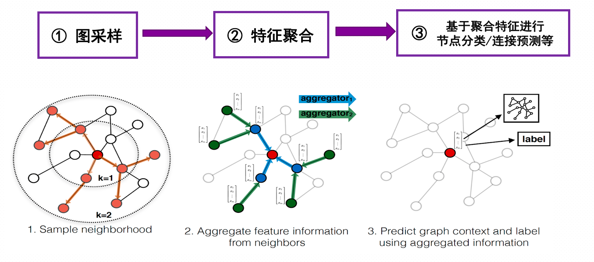

# Quiver

## 一、整体介绍
所有研究图机器学习系统的团队都知道基于采样的图模型训练性能瓶颈在图采样和特征提取上，但两个瓶颈背后的本质到底是什么？Quiver核心观点是：

- 图采样是一个**latency critical problem**，高性能的采样核心在于通过大量并行掩盖访问延迟。
- 特征提取是一个**bandwidth critical problem**，高性能的特征提取在于优化聚合带宽。




一般情况下，我们选择使用CPU进行图采样和特征提取，这种方案不仅会带来单卡训练的性能问题，同时由于采样与特征提取均为CPU密集型操作，多卡训练时会**由于CPU计算资源的瓶颈导致训练扩展性不理想**。我们以`ogbn-product`数据集为例benchmark `Pyg`和`DGL`两个框架使用CPU采样和特征提取时的多卡训练扩展性结果如下：

`说明`: 测试代码见[这里](../examples/multi_gpu/pyg/ogb-products/dist_sampling_ogb_products_pyg.py)

| Framework | Device Num | Epoch Time(s) |Scalability|
| ------ | ------ | ------ |------|
| Pyg | 1 | 36.5 |1.0|
| Pyg | 2 | 31.3 |1.16|
| Pyg | 3 | 28.1|1.30|
| Pyg | 4 |  29.1|1.25|
| DGL | 1 |  ||
| DGL | 2 |  ||
| DGL | 3 |  ||
| DGL | 4 |  ||


我们本次开源的单机版本的Quiver是一个即插即用并且充分压榨硬件潜力的高性能GNN训练组件，用户可使用Quiver在单机上训练GNN时拥有**更好的性能**，并且拥有**更好的多卡扩展性**，甚至在拥有NVLink的情况下，获得**多卡超线性加速收益**。接下来我们分别介绍我们在图采样和特征提取性能优化上的工作与经验。

## 二、图采样

### 2.1 当前已有方案
当前的开源系统中已经支持CPU采样和GPU采样，其中GPU采样需要将整个图存储到GPU显存中。CPU采样往往受困于采样性能以及训练扩展性，而GPU采样因为显存大小的限制，使得能够处理的图的尺寸往往有限。

### 2.2 Quiver方案
`说明`: 测试代码见[这里](../benchmarks/sample/bench_sampler.py)

Quiver中向用户提供**UVA-Based**（Unified Virtual Addressing Based）图采样算子，支持用户在图拓扑数据较大时选择将图存储在CPU内存中的同时使用GPU进行采样。这样我们不仅获得了远高于CPU采样的性能收益，同时能够处理的图的大小从GPU显存大小限制扩展到了CPU内存大小(一般远远大于GPU显存)。我们在`ogbn-products`和`reddit`上的两个数据集上进行采样性能测试显示，UVA-Based的采样性能远远高于CPU采样性能(CPU采样使用Pyg的采样实现为基线)，我们衡量采样性能的指标为单位时间内的采样边数(**S**ampled **E**dges **P**er **S**econd, **SEPS**)。**我们可以看到在同样不需要存储图在GPU显存中的情况下，Quiver的采样在真实数据集上提供大约20倍的性能加速**。

| Dataset | Parameter | Sampler |SEPS|Speedup Over CPU|
| ------ | ------ | ------ |------|------|
| ogbn-product | [15, 10, 5] | CPU |1.84 M|1.0|
| ogbn-product | [15, 10, 5] | UVA(`on host memory`) |34.29 M|18.63|
| reddit | [25, 10] | CPU |2 M|1.0|
| reddit | [25, 10] | UVA(`on host memory`) |33.15 M|16.575|

同时，Quiver的采样算子不仅可以工作在UVA模式下，当用户的GPU足够放下整个图的拓扑数据时，可通过设置采样参数`mode='GPU'`选择将图放置在GPU上以获得更高的性能。从我们过往的实验中发现，设置`mode='GPU'`, 相比较UVA模式能够带来30%-40%的性能提升。


```python

    dataset = PygNodePropPredDataset('ogbn-products', root)
    csr_topo = quiver.CSRTopo(dataset[0].edge_index)

    # You can set mode='GPU' to choose place graph data in GPU memory
    quiver_sampler = quiver.pyg.GraphSageSampler(csr_topo, [15, 10, 5], device=0, mode="UVA")
```

不仅如此，由于UVA采样不占用CPU计算资源，这样避免了多卡扩展时对CPU资源的竞争，进而带来了更好的训练扩展性，这部分内容我们在下文的端到端性能实验中进一步说明。


## 三、图特征提取（Feature Collection）
`说明`: 测试代码见[这里](../benchmarks/feature/bench_feature.py)

### 3.1 当前已有方案
由于GNN训练时一个batch的特征数据往往有数百MB甚至几个GB，这些特征数据任何一次在CPU内存中的搬运，以及CPU到GPU之间的数据搬运都有着较大的耗时。图特征提取优化的核心在于优化端到端的吞吐，即从特征获取到传输到GPU过程的吞吐。现有的方案一般分为两种:


1. CPU进行特征提取，并将聚合特征传输到GPU进行训练
2. 当特征数据较少时，将全部特征放到GPU显存中

同样，基于CPU的方案1面临着吞吐性能的问题，同时CPU的Feature Collection本身为CPU密集型操作，同样面临着多卡训练时由于对CPU资源的竞争导致特征提取的多卡扩展性较差。而基于GPU存储的方案2也同样面临着处理的图特征受限于GPU显存大小。

### 3.2 Quiver方案

Quiver提供了高吞吐的`quiver.Feature`用于进行特征提取。`quiver.Feature`的实现主要基于如下两个观察：

- 1 真实图往往具有幂律分布特性，少部分节点占据了整图大部分的连接数，而大部分基于图拓扑进行采样的算法，最终一个Epoch中每个节点被采样到的概率与该节点的连接数成正相关。我们在下面的表格中展示两个数据集中节点度高于整个图的平均节点度的点的数目，以及这些点的连接数占整个全图的连接数的比值。我们发现训练中少部分节点的特征将被高频访问。

| Dataset | #(degree > average_degree)/total_nodes_count | 连接数高于平均节点度的点度 |
| ------ | ------ | ------ |
| ogbn-product | 31.3%| 76.8% |
| reddit | 29.8% | 77.1% |


- 2 一个AI Server中的各种访问传输带宽大小关系如下 GPU Global Memory > GPU P2P With NVLink > Pinned Memory > Pageble Memory。

考虑到上述的访问带宽层级关系以及图节点的访问不均匀性质，Quiver中的`quiver.Feature`根据用户配置的参数将特征进行自动划分存储在GPU显存以及CPU Pinned Memory中。并将热点数据存储在GPU，冷数据存储在CPU中（用户需要传入`csr_topo`参数），特征提取时使用GPU来进行统一访问。


#### 3.2.1 单卡

首先我们展示单卡训练时的Feature性能表现。我们在下表中展示当只缓存20%的特征热数据在GPU中时的 `quiver.Feature`吞吐性能与常规CPU特征提取并传输到GPU上的性能对比。

| Dataset | Feature | Throughput(GB/s) |Speedup Over CPU|
| ------ | ------ | ------ |------|
| ogbn-product | CPU |  1.27|1.0|
| ogbn-product | Quiver | 14.82 |10|
| reddit | CPU | 2.98 |1.0|
| reddit | Quiver|11.66  |3.91|


#### 3.2.2 多卡

多卡训练时的特征缓存策略根据GPU之间是否有NVLink等高速互联而分为`device_replicate`和`p2p_clique_replicate`。首先介绍`device_replicate`。

**device replicate**

`device_replicate`策略即当使用多卡训练时，热数据在每个卡间进行复制存储，同时多卡训练的进程共享CPU中的冷数据。


**p2p_clique_replicate**

考虑到当有NVLink的情况下，基于GPU之间P2P技术的特征提取相比较从CPU内存中进行特征提取的带宽更高，于是多卡训练时，处在同一个`p2p_clique`之内的GPU(即两两互相NVLink链接)共享缓存热数据。即如果每个GPU能缓存20%数据，一个大小为4的`p2p_clique`可以缓存80%的数据，同时所有处在`p2p_clique`内的GPU共享访问这些热数据。


这样的策略下我们不仅在更多卡加入时能提供更大的缓存，同时由于这部分数据的访问带宽更高，我们便可以实现**特征提取的多卡超线性加速**，即当有两个GPU加入时，两个GPU的特征提取吞吐总速度大于一个只有一个GPU时的特征提取吞吐速度。

| Dataset | Device Num | Total Throughput(GB/s) |Speedup Over Single Device|
| ------ | ------ | ------ |------|
| ogbn-product | 1 |  20.29|1.0|
| ogbn-product | 2 | 108.6 |5.35|
| reddit | 1 | |1.0|21.38|1.0|
| reddit | 2|  |3.91|88.34|4.13|

特征提取的超线性加速意味着我们在多卡训练时也有可能达到训练速度的多卡超线性加速。


``` python
# set cache_policy="device_replicate" if you dont have NVLink
quiver_feature = quiver.Feature(rank=0, device_list=[0, 1], device_cache_size="110M", cache_policy="p2p_clique_replicate", csr_topo=csr_topo)
quiver_feature.from_cpu_tensor(dataset[0].x)
```

## 四、端到端性能

Quiver为用户提供了高性能的GNN训练核心组件，用户可以自由和CPU采样/CPU特征提取方式进行组合使用。接下来我们介绍使用Quiver可以达到的优异的单卡性能以及多卡扩展性。

### 4.1 cache_policy = device_replicate

我们以`ogbn-product`为例子进行benchmark实验验证, 我们首先对比Quiver和使用CPU来进行特征提取和采样的Pyg性能。实验中每个训练进程中的采样并行度为5。

| Device Num | Pyg's Epoch Time | Pyg's  Scalability |Quiver's Epoch Time | Quiver's  Scalability|Quiver Over Pyg|
| ------ | ------ | ------ |------|------|------|
| 1 | 36.5 |  1.0|11.1|1.0|3.23|
| 2| 30 | 1.22 |5.8|1.91|5.17|
| 3 | 27.7 | 1.32|4.7|2.71|6.75|
| 4 | 28.2|  1.28|3.25|3.42|8.68|

即使是在Pyg将所有数据均放在GPU中并使用GPU进行特征提取，Quiver仍然能在4卡训练时有比Pyg大约3倍的加速。

| Device Num | Pyg's Epoch Time | Pyg's  Scalability |Quiver Over Pyg|
| ------ | ------ | ------ |------|
| 1 | 23.3 |  1.0|2.1|
| 2| 14.7 | 1.59 |2.53|
| 3 | 11.4 | 2.04|2.78|
| 4 | 9.5|  2.45|2.92|

我们发现Quiver拥有更好的性能的同时，多卡训练的扩展性上表现也更为优秀。

### 4.2 cache_policy = p2p_clique_replicate

当我们在带有NVLink的机器上训练`ogb-product`数据以及`reddit`数据，两卡训练的加速比分别为2.25和2.75(batch_size=2048), 这是由于两卡训练时，采样和GPU模型计算部分性能为线性扩展，而特征提取却为超线性扩展，故而带来了训练端到端性能的超线性扩展。


## 五、未来展望
本次我们只是开源了Quiver的单机版本。在未来我们将继续开源如下特性，敬请期待！：

1. **基于CPU、GPU混合计算的采样和特征提取**：目前我们的所有采样和特征获取均为GPU执行，而单机上的CPU所具备的强大算力同样不可忽视。未来我们将研究并开源`mode=MIXED`的模式下，借助CPU和GPU并行采样和特征提取的加速。
2. **分布式Quiver**：接下来我们将进一步研究并开源分布式版本的Quiver以帮助用户高效训练超大规模的图。


## 六、总结

路漫漫其修远兮，吾将上下而求索。**quiver-team**社区致力于研究自适应，可扩展的AI系统，本次我们开源的Quiver致力于通过充分挖掘硬件性能来帮助用户更快速，更具有扩展性的训练GNN模型。Quiver还处在积极的开发中，我们也希望志同道合的朋友们能参与共建Quiver，一起向整个GNN社区提供更快的训练、推理系统。


