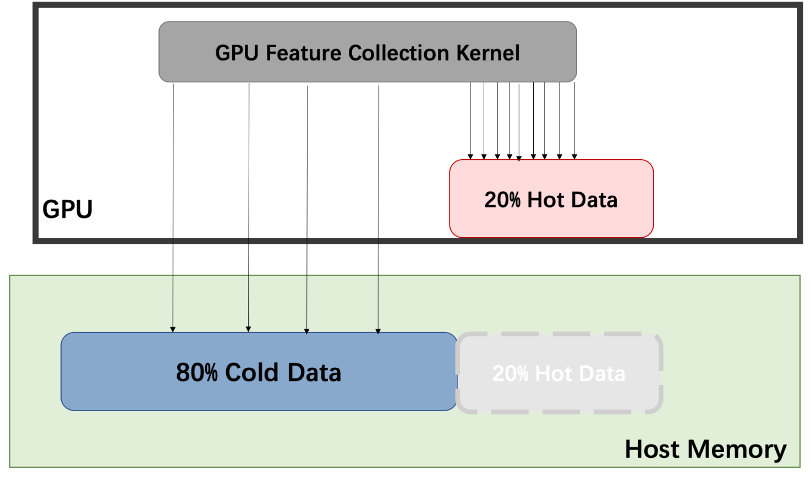
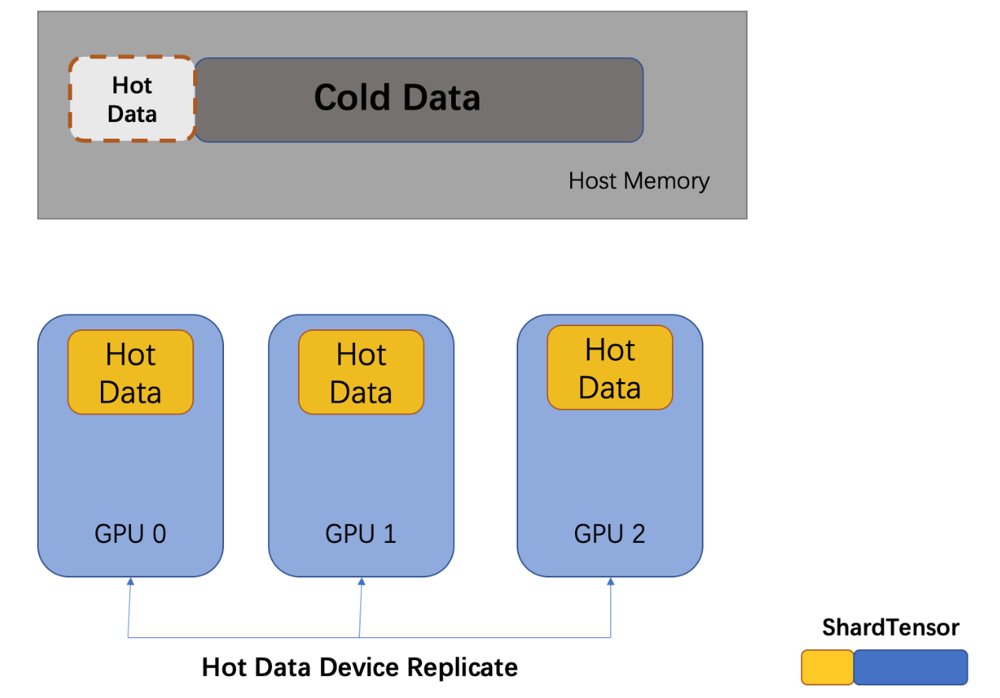
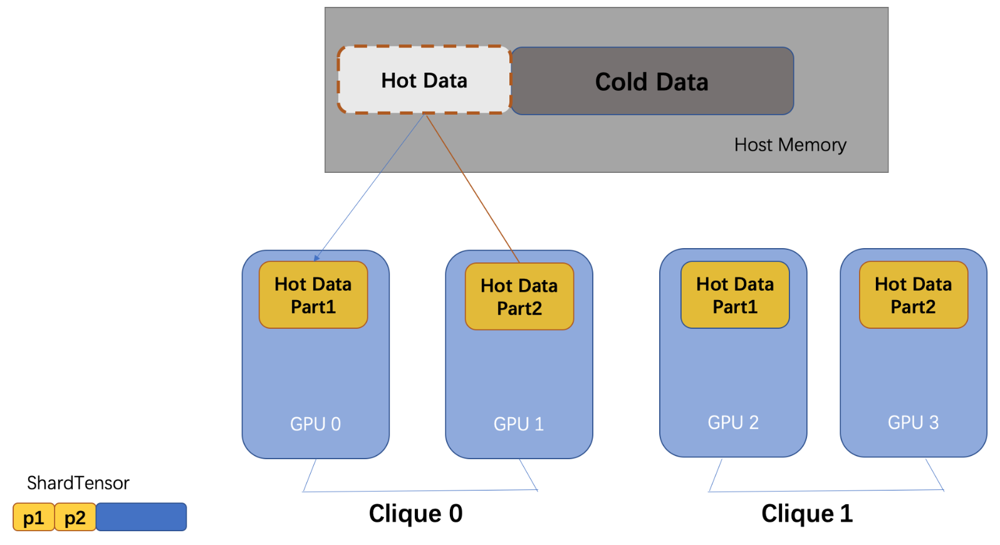

# Quiver

## 1 Overview
The unique characteristic of graph learning systems is that the preprocessing with graph structures and the collection of features are usually the bottlenecks. How to resolve those two bottlenecks? Quiver's core ideas are:
- Graph sampling is a **latency critical problem**, so massive parallelism could hide the latency.
- Feature collection is a **bandwidth critical problem**, so bandwidth should be optimized to achieve high performance.


Normally, we choose to use CPU to sample the graph and collect features. This strategy will not only cause performance issues when we use single-GPU training but also cause **poor scalability because of CPU resource sharing**. Below is the benchmark of training `ogbn-product` with `PYG` and `DGL`, on the scalability of multi-GPU training with CPU sampling and feature collection:

`Note`: Benchmark code [here](examples/multi_gpu/pyg/ogb-products/dist_sampling_ogb_products_pyg.py)

| Framework | Device Num | Epoch Time(s) |Scalability|
| ------ | ------ | ------ |------|
| Pyg | 1 | 36.5 |1.0|
| Pyg | 2 | 31.3 |1.16|
| Pyg | 3 | 28.1|1.30|
| Pyg | 4 | 29.1|1.25|
| DGL | 1 |  ||
| DGL | 2 |  ||
| DGL | 3 |  ||
| DGL | 4 |  ||

Our Quiver is a high-performance GNN training add-on which can fully utilize the hardware. Users will have **better end-to-end performance** and **better scalability** of multi-GPU GNN training. We even achieve **super linear scalability** with the help of NVLink. Next we will introduce our contributions on the optimizations of graph sampling and feature collection.

## 2 Graph Sampling

### 2.1 Existing Approaches
Existing graph learning frameworks support both CPU and GPU sampling. GPU sampling needs to store the entire graph structure on GPU memory, which is a limit when the graph is large. CPU sampling has poor performance and bad scalability.

### 2.2 Quiver's Approach
`Note`: Benchmark code[here](benchmarks/sample/bench_sampler.py)

Quiver provide users with **UVA-Based**（Unified Virtual Addressing Based）graph sampling operator, supporting storing graph structure in CPU memory and sampling the graph with GPU when the graph is large. In this way, we not only get performance benefits beyond CPU sampling, but also sample the graph whose size is beyond GPU memory. We evaluate our sampling performance on `ogbn-products`and`reddit` datasets, and we find that the performance of UVA-based sampling is much higher than CPU sampling. Our sampling metrics are the sampling throughput (**S**ampled **E**dges **P**er **S**econd, **SEPS**). **We can observe that without storing the graph on GPU, Quiver get 20x speedup on real datasets**.

| Dataset | Parameter | Sampler |SEPS|Speedup Over CPU|
| ------ | ------ | ------ |------|------|
| ogbn-product | [15, 10, 5] | CPU |1.84 M|1.0|
| ogbn-product | [15, 10, 5] | UVA(`on host memory`) |34.29 M|18.63|
| reddit | [25, 10] | CPU |2 M|1.0|
| reddit | [25, 10] | UVA(`on host memory`) |33.15 M|16.575|

Meanwhile, Quiver's sampling can be configured to enable GPU-only sampling (`mode='GPU'`), which put the whole graph structure to GPU memory to achieve higher performance. Compared to UVA mode, this sampling strategy will 30-40% speedup with extra GPU memory cost.


```python

    dataset = PygNodePropPredDataset('ogbn-products', root)
    csr_topo = quiver.CSRTopo(dataset[0].edge_index)

    # You can set mode='GPU' to choose place graph data in GPU memory
    quiver_sampler = quiver.pyg.GraphSageSampler(csr_topo, [15, 10, 5], device=0, mode="UVA")
```

Furthermore, UVA sampling will not cost CPU computation resources, which avoid contention when we train with multiple GPUs and have a better scalability. This part will be further explained in our end-to-end performance benchmark.

## 3 Feature Collection
`Note`: Benchmark code[here](benchmarks/feature/bench_feature.py)

### 3.1 Existing Approaches
The feature size of one batch in GNN training is usually hundreds of MB or even several GB. The feature collection time, especially the CPU-to-GPU case, have significant cost. The core idea of optimizing feature collection is to optimise the throughput of feature transfer. Existing approaches are:

1. Collect feature on CPU, and transfer the result to GPU for training
2. When feature size is small, put all feature data on GPU and collect the batch

Approach 1 has a much lower throughput, and it has a poor scalability because multiple workers will share CPU memory bandwidth.

### 3.2 Quiver's Approach

Quiver provides feature collection `quiver.Feature` with high throughput. The implementation of `quiver.Feature` is based on two observations below:

1. Real graph datasets usually follow the power low, which means most of the edges in the graph are associated with a small portion of nodes. Most sampling algorithms based on graph structure will sample more nodes whose degree are higher. We show in the table below that two datasets follow our observations.

| Dataset | #(degree > average_degree)/total_nodes_count | #edges(with node degree > average)/total_edges_count |
| ------ | ------ | ------ |
| ogbn-product | 31.3%| 76.8% |
| reddit | 29.8% | 77.1% |

2. Memory bandwidth relationship of a GPU server is: GPU Global Memory > GPU P2P With NVLink > Pinned Memory > Pageble Memory.

Considering the bandwidth and the power law, Quiver's `quiver.Feature` can allocate features automatically to GPU memory and CPU Pinned Memory. It can also host hot data on GPU and cold data on CPU (if `csr_topo` is provided). We collect features with GPU.



#### 3.2.1 Single-GPU

First we show our performance of feature collection using one GPU. The table below shows the performance of `quiver.Feature` when we cache 20% hot data on GPU cpmpare with normal CPU feature collection.

| Dataset | Feature | Throughput(GB/s) |Speedup Over CPU|
| ------ | ------ | ------ |------|
| ogbn-product | CPU |  1.27|1.0|
| ogbn-product | Quiver | 14.82 |10|
| reddit | CPU | 2.98 |1.0|
| reddit | Quiver|11.66  |3.91|


#### 3.2.2 Multi-GPU

Multi-GPU caching strategy can be classified as `device_replicate` and `p2p_clique_replicate`, depending on whether NVLink is supported between GPUs. First, we take a look at `device_replicate`.

**device replicate**

`device_replicate` strategy is to replicate hot data across GPUs, and they will share the cold data on CPU memory.



**p2p_clique_replicate**

When NVLink is supported, feature collection with P2P between GPUs has a higher bandwidth than collecting features from CPU, so GPUs inside a `p2p_clique` will share a hot feature cache. The hot data cache will be larger when each GPU hold a partition of it.




In this way we provide larger cache size, and we achieve **super-linear scalability** because the interconnects between hot cache partitions are much higher.

| Dataset | Device Num | Total Throughput(GB/s) |Speedup Over Single Device|
| ------ | ------ | ------ |------|
| ogbn-product | 1 |  20.29|1.0|
| ogbn-product | 2 | 108.6 |5.35|
| reddit | 1 | |1.0|21.38|1.0|
| reddit | 2|  |3.91|88.34|4.13|

The super-linear scalability of feature collection will make the super-linear speedup of the whole training pipeline.

``` python
# set cache_policy="device_replicate" if you dont have NVLink
quiver_feature = quiver.Feature(rank=0, device_list=[0, 1], device_cache_size="110M", cache_policy="p2p_clique_replicate", csr_topo=csr_topo)
quiver_feature.from_cpu_tensor(dataset[0].x)
```

## 4 End-to-end Performance

Quiver provides high-performance components for GNN training. Users will have the freedom to make choices of sampling and feature collection combined strategy. 

### 4.1 cache_policy = device_replicate

We evaluate on the `ogbn-product` dataset, and we compare Quiver with CPU feature collection and sampling from Pyg. The parallelism of each sampling process is 5.

| Device Num | Pyg's Epoch Time | Pyg's  Scalability |Quiver's Epoch Time | Quiver's  Scalability|Quiver Over Pyg|
| ------ | ------ | ------ |------|------|------|
| 1 | 36.5 |  1.0|11.1|1.0|3.23|
| 2| 30 | 1.22 |5.8|1.91|5.17|
| 3 | 27.7 | 1.32|4.7|2.71|6.75|
| 4 | 28.2|  1.28|3.25|3.42|8.68|

Even when we put all feature on GPU and use GPU to collect feature, Quiver still have 3x speedup over Pyg.

| Device Num | Pyg's Epoch Time | Pyg's  Scalability |Quiver Over Pyg|
| ------ | ------ | ------ |------|
| 1 | 23.3 |  1.0|2.1|
| 2| 14.7 | 1.59 |2.53|
| 3 | 11.4 | 2.04|2.78|
| 4 | 9.5|  2.45|2.92|

We show that Quiver has a better performance and a better scalability.

### 4.2 cache_policy = p2p_clique_replicate

When we train `ogb-product` and `reddit` datasets on the machine with NVLink, the speedup with 2 GPUs are 2.25 and 2.75(batch_size=2048), which shows the super-linear scalability of our feature collection strategy.

## 5 Future Works

This time we open-source the single-machine version of Quiver. Next we will work on new features below:

1. **Adaptive allocation**: Now the strategy choice of feature collection and sampling is manually configured. This could be improved by providing the mechanism of making such decisions automatically according to the characteristics of the workload and hardware.
2. **Distributed Quiver**：Next we will support multi-machine distributed version of Quiver to train larger datasets.

## 6 End

The **quiver-team** community will work on adaptive and scalable AI systems. Quiver will fully utilize hardware to help users train GNN efficiently. Quiver is being developed actively, and we hope people who are interested can build Quiver and make it a better GNN system.


